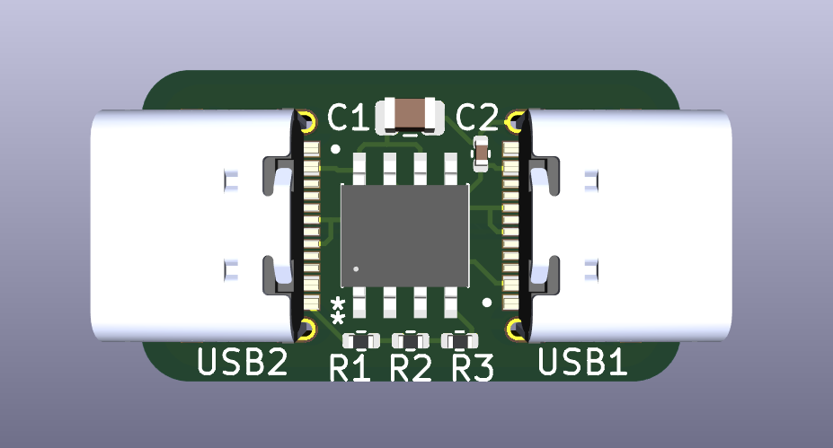

# Beyondex Limiter

This is a simple USB 2.0 Type C current limiter built around the [MIC2544-1YM](resources/mic2544.pdf) current limiting IC. The default current limit is set at 200mA, but the resistors can be swapped out according to the data sheet for any limit bwteen 100mA to 1.5A.

Resistor configurations I've used:

* 150 + 330 + 680 = 198mA limit
* 2k + 150 +150 = 100mA limit

The left port is for the end device and the right port is to connect upstream.
