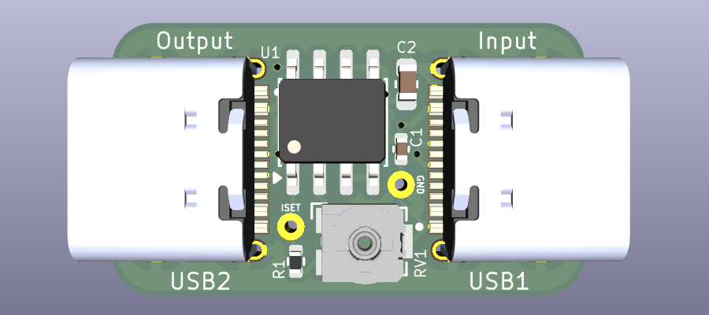
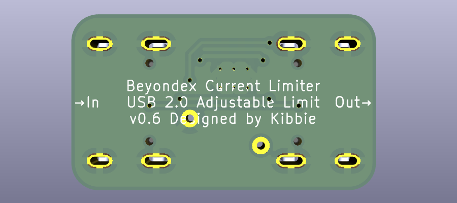

# Beyondex Limiter

This is a simple USB 2.0 Type C current limiter built around the [CN5711](resources/CN5711.pdf) current regulation IC. The default current limit is adjustable in the range of ~70mA to ~500mA using the onboard potentiometer, but the upper limit resistor and potentiometer can be removed in favor of a fixed through-hole resistor set for fixed operation with a limit up to 1.5A.

Resistor Configuration:

The current limit in amps is determined using the formula 1800 / ISET, where ISET is the resistance in ohms.

The maximum current resistor provides a minimum resistance of 3600 ohms, so when the potentiometer is turned fully clockwise adding no extra resistance, the limit is 1800 / 3600 = 0.5A.

When the potentiometer is turned couterclockwise to its full resistance of 20k ohms, the total resistance is 23.6k ohms, so the limit is 1800 / 23600 = 0.076A, or ~76mA.

To fix the limiter to a non-adjustable limit, remove R1 or the potentiometer and solder a resistance between the ISET and GND through holes.

The left port is for the end device and the right port is to connect upstream.

The back contains the specs and additional input/output labels.

## How to Order

1. Go to the [latest release](https://github.com/KibbieKatt/BeyondexLimiter/releases)
2. Download:
    * `BeyondexLimiter.zip` - not the Source code!
    * `bom.csv`
    * `positions.csv`
3. Upload the zip file to JLCPCB's quote page.
4. Verify that board image is shown and size is auto populated.
    * If it doesn't show the PCB image or size after uploading completes, try making an account, uploading the file, and checking Projects > Quotes if it still doesn't show up.
5. All the defaults are OK, but you can change the quantity and color
6. At the bottom, enable PCBA to get fully assembled boards, unless you want to solder the tiny resistors yourself. The PCBA defaults are also OK.
7. Adjust the build time on the right if desired, and click Next
8. Confirm the PCB shown (it will show the bare board without components) by clicking Next again
9. Upload the BOM (`bom.csv`) and CPL (`positions.csv`), press "Process BOM & CPL"
10. The list of components will be shown.
    * This is where the resistor values can be swapped out if you would like a different maximum to the adjustable value.
    * Review the matched part columns for each component, they should be pre-filled using the parts I used.
    * If any part I used is no longer available, you will need to search for the same or equivalent replacement.
    * Click on any row and use "Search Part" to swap them out.
    * Be sure the component value is correct and that the footprint code matches the original part, so that the replacement fits on the board.
11. Press Next to preview the component placement. The USB ports will be wrong, but apparently the engineers will correct it anyways. You can still drag them to the correct spot.
12. Review your order, select a description (I use DIY Hobby Circuit), add to cart, select the order in the cart, complete checkout.
    * Tip: DDP shipping with DHL/FedEx includes customs and should be the simplest option.
